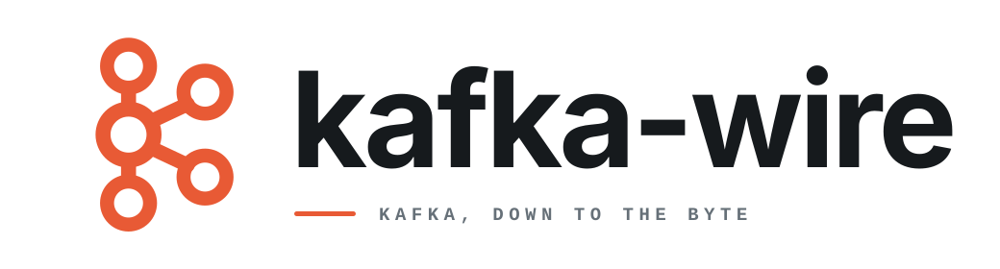

<p align="center">
  
</p>

<p align="center"><strong>Generated Kafka messages and record batches for Rust.</strong></p>
<p align="center">Sans-I/O. Version-aware. Bounded at every peer-controlled boundary.</p>

<p align="center">
  <a href="#model">Model</a> ·
  <a href="#crates">Crates</a> ·
  <a href="#example">Example</a> ·
  <a href="#proof">Proof</a> ·
  <a href="#status">Status</a>
</p>

<br />

`kafka-wire` owns the bytes between a Kafka client and broker: generated
request and response messages, version ranges, headers, complete request
framing, and RecordBatch v2 encoding and decoding. It performs no networking
and depends on no async runtime.

## Model

The runtime is split at the wire boundary:

```text
kafka-wire-core       versions, strings, UUIDs, codecs, decode limits
├── kafka-wire         generated messages, descriptors, request framing
└── kafka-wire-records RecordBatch v2 and compression
```

The caller owns sockets, correlation allocation, version negotiation, routing,
retries, and deadlines. Peer-controlled frame and field lengths, array counts,
tagged fields, decompression, and outbound frames are bounded during parsing.
Generated values expose recursive retained-footprint accounting for caller
admission policy.

## Crates

| Crate | Purpose |
| --- | --- |
| `kafka-wire` | Generated request and response types, API descriptors, pairings, headers, and whole-request framing. |
| `kafka-wire-core` | API-independent versions, strings, UUIDs, tagged fields, and bounded codecs. |
| `kafka-wire-records` | Bounded RecordBatch v2 validation, encoding, decoding, and gzip, LZ4, Snappy, and Zstandard compression. |

Applications using generated messages currently depend on both `kafka-wire`
and `kafka-wire-core`: version and codec vocabulary lives in the core crate.
Record support is separate so message-only users do not pull compression
libraries into their dependency graph.

## Example

Encode an `ApiVersions` v3 request as a complete Kafka frame:

```rust
use bytes::BytesMut;
use kafka_wire::{ApiVersionsRequest, OutboundFrameLimits, encode_request};
use kafka_wire_core::{ApiVersion, EncodeError, StrBytes};

fn api_versions_frame() -> Result<BytesMut, EncodeError> {
    let mut request = ApiVersionsRequest::default();
    request.client_software_name = StrBytes::from("acme");
    request.client_software_version = StrBytes::from("1.0");

    let mut frame = BytesMut::new();
    encode_request(
        &mut frame,
        1,
        None,
        &request,
        ApiVersion::new(3),
        OutboundFrameLimits::new(1024 * 1024),
    )?;
    Ok(frame)
}
```

The output begins with Kafka's signed 32-bit frame length, followed by the
version-correct request header and message body. If validation fails, the
destination buffer is restored to its original length.

## Proof

The generated tree is pinned to Apache Kafka commit
`678c0e07e4733c5a592e52046dc2c4e1625587f1`.

- 201 pinned upstream schemas: 193 generated and 8 explicitly retired upstream
- 1,392 Kafka-authored byte vectors across 638 files
- 18 record-batch fixtures covering uncompressed, gzip, LZ4, Snappy, and
  Zstandard data, including control and delete-horizon batches
- 99 generated files with per-input provenance and a checked tree manifest
- adversarial generation probes, architecture boundaries, fuzz targets, lints, tests, and rustdoc

Ordinary verification is offline and requires neither Java nor Kafka. Java is
used only when a maintainer deliberately re-authors the checked-in evidence
from the pinned Kafka build.

## Development

Rust 1.88 or newer and `just` are required. Run the complete repository gate
with:

```sh
just check
```

This checks generated identity, the complete pinned schema corpus, executable
architecture boundaries, byte vectors, record batches, formatting, lints,
tests, and rustdoc. `cargo xtask generate` deliberately replaces the generated
tree; `cargo xtask vendor` is the only command that updates pinned upstream
inputs and requires network access.

## Status

Version 0.1.0-rc.3 is the current release candidate for Kafka clients and wire
tooling. The public surfaces of the three runtime crates remain compatibility-
protected against v0.1.0-rc.1 while qualification through downstream clients
continues. Compatible additions may still land before 0.1.0.

## License

Apache-2.0. Apache Kafka is a trademark of the Apache Software Foundation. This
project is independent and is not endorsed by the Apache Software Foundation.

See [`CONTRIBUTING.md`](CONTRIBUTING.md),
[`CODE_OF_CONDUCT.md`](CODE_OF_CONDUCT.md), and [`SECURITY.md`](SECURITY.md).
